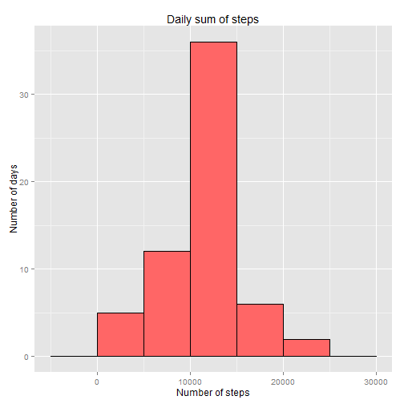

# Peer Assessment 1
### Rafal Wawrzynczyk

This is a R Markdown file containing PA 1 analysis from Coursera's "Reproducible Research" course. The aim of the analysis is to answer a few questions regarding data from personal activity monitoring device.

## Loading the data

We assume that **repdata-data-activity.zip** file is in working directory.


```r
data <- read.csv(unz("repdata-data-activity.zip", "activity.csv"))
```

## What is mean total number of steps taken per day?

According to instructions from assessment, we can ignore missing values in the data. We do this by selecting only these rows, which don't have any missing values.


```r
data_complete <- data[complete.cases(data),]

library(plyr)
tmp_total_steps <- ddply(data_complete, c("date"), summarise, Total_steps=sum(steps))
```

Using **ggplot2** package we make a required histogram.


```r
library(ggplot2)
p1 <- ggplot(data=tmp_total_steps, aes(x=Total_steps))
p1 <- p1 + xlab("Number of steps")
p1 <- p1 + ylab("Number of days")
p1 <- p1 + ggtitle("Daily sum of steps")
p1 <- p1 + geom_histogram(binwidth=5000,colour="black", fill="#FF6666")
print(p1)
```

 

We use `tmp_total_steps` object to find mean and median total number of steps taken by day:


```r
mean(tmp_total_steps$Total_steps)
```

```
## [1] 10766.19
```

```r
median(tmp_total_steps$Total_steps)
```

```
## [1] 10765
```

## What is the average daily activity pattern?

Answering this question we still assume that missing values are removed from computation (i.e. we operate on `data_complete` table instead on the whole `data`. As `interval` is not linear (after 55 we get 100), we add custom column (`Interval_no`) with number of interval during the day.


```r
data_complete$interval <- factor(data_complete$interval)
tmp_avg_steps_interval <- ddply(data_complete, c("interval"), summarise, Avg_steps=mean(steps))
tmp_avg_steps_interval$Interval_no <- seq(1:288)
```


```r
p2 <- ggplot(data=tmp_avg_steps_interval, aes(Interval_no, Avg_steps))
p2 <- p2 + geom_line(colour="blue")
p2 <- p2 + xlab("Number of 5-minute interval during the day")
p2 <- p2 + ylab("Average number of steps")
p2 <- p2 + ggtitle("Average number of steps in 5-minutes intervals")
print(p2)
```

 

Next, we seek the 5-minute interval that, on average, contains the maximum number of steps.


```r
tmp_avg_steps_interval[tmp_avg_steps_interval$Interval_no==which.max(tmp_avg_steps_interval$Avg_steps),]
```

```
##     interval Avg_steps Interval_no
## 104      835  206.1698         104
```

As we can see, the answer is the 5-minutes interval No. 104, which stands for the one starting at 8:35.

## Imputing missing values

We count the total number of rows containing at least one missing value.


```r
sum(!complete.cases(data))
```

```
## [1] 2304
```

We check how the NAs are distributed among the columns:


```r
sapply(data, function(x)(sum(is.na(x))))
```

```
##    steps     date interval 
##     2304        0        0
```

As we can see, all NAs occur only in the `steps` column. To impute the missing values, we will use mean value of steps for the particular 5-minute interval. The 5-minutes means are stored in `tmp_avg_steps_intervals` object.


```r
m <- merge(data, tmp_avg_steps_interval[c("interval","Avg_steps")], by.x="interval", by.y="interval")
m$steps_imp <- ifelse(is.na(m$steps), m$Avg_steps, m$steps)
data_imp <- m[,c("interval","steps_imp","date")]
```

After missing imputation, we check the distribution of total steps per day variable.


```r
tmp_total_steps_imp <- ddply(data_imp, c("date"), summarise, Total_steps_imp=sum(steps_imp))
```


```r
p3 <- ggplot(data=tmp_total_steps_imp, aes(x=Total_steps_imp))
p3 <- p3 + xlab("Number of steps")
p3 <- p3 + ylab("Number of days")
p3 <- p3 + ggtitle("Daily sum of steps")
p3 <- p3 + geom_histogram(binwidth=5000,colour="black", fill="#FF6666")
print(p3)
```

 

We check if mean and median of steps per day has changed:


```r
mean(tmp_total_steps_imp$Total_steps_imp)
```

```
## [1] 10766.19
```

```r
median(tmp_total_steps_imp$Total_steps_imp)
```

```
## [1] 10766.19
```

As we can observe, the mean and median values almost haven't changed. To compare the changes between the histograms before and after the imputation, we will draw them again in the one picture.


```r
names(tmp_total_steps_imp) <- names(tmp_total_steps)
tmp_total_steps$dataset <- "before imputation"
tmp_total_steps_imp$dataset <- "after imputation"
tmp <- rbind(tmp_total_steps, tmp_total_steps_imp)
```


```r
p4 <- ggplot(data=tmp, aes(x=Total_steps, fill=dataset))
p4 <- p4 + xlab("Number of steps")
p4 <- p4 + ylab("Number of days")
p4 <- p4 + ggtitle("Daily sum of steps")
p4 <- p4 + geom_histogram(binwidth=5000,colour="black",position="dodge")
print(p4)
```

 

The conclusion is that the impution changed only the number of days that have number of steps from (10000, 15000) interval (the one with mean and median values).

## Are there differences in activity patterns between weekdays and weekends?

According to the instruction from the assessment, we use the dataset with imputed missings (`data_imp`) in this part.


```r
data_imp$day <- weekdays(as.POSIXct(data_imp$date))
data_imp$day_class <- ifelse(data_imp$day=="Saturday" | data_imp$day=="Sunday","weekend","weekday")

data_imp$day_class <- factor(data_imp$day_class)
data_imp$interval <- factor(data_imp$interval)

tmp_avg_steps_interval_w <- ddply(data_imp, c("day_class","interval"), summarise, Avg_steps=mean(steps_imp))
tmp_avg_steps_interval_w$Interval_no <- c(seq(1:288),seq(1:288))
```

We make required panelplot using **ggplot2** package.


```r
p5 <- ggplot(data=tmp_avg_steps_interval_w, aes(Interval_no, Avg_steps))
p5 <- p5 + facet_grid(day_class ~ .)
p5 <- p5 + geom_line(colour="blue")
p5 <- p5 + xlab("Number of 5-minute interval during the day")
p5 <- p5 + ylab("Average number of steps")
p5 <- p5 + ggtitle("Average number of steps in 5-minutes intervals")
print(p5)
```

 
